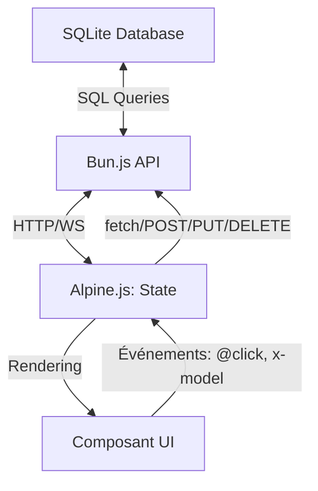

# Guide : Data Mapping avec SQLite, Bun.js et Alpine.js

Ce document explique comment créer des **tableaux de data mapping** pour des applications utilisant **SQLite** (backend), **Bun.js** (runtime et API HTTP/WebSocket), et **Alpine.js** (state et UI). L'objectif est de tracer le flux des données entre ces couches.

---

## **1. Contexte Spécifique**

### **Architecture**
- **Backend** : **SQLite** (base de données relationnelle intégrée via `bun:sqlite`).
- **Serveur** : **Bun.js** (runtime JavaScript/TypeScript avec support natif SQLite).
- **API** : HTTP REST ou WebSocket pour la communication frontend/backend.
- **Frontend** : **Alpine.js** (state réactif et UI).

### **Spécificités**
- **SQLite est serveur-side** : Pas de connexion directe depuis le frontend, nécessite une API.
- **Pas de sync automatique** : Les mises à jour se font via des requêtes HTTP explicites ou WebSocket.
- **Bun.js intègre SQLite** : Utilisation de `import { Database } from "bun:sqlite"`.

---

## **2. Sources à Utiliser**

### **📁 `data/`**
- Contient les **schémas de la base SQLite** (tables, colonnes, types).
- **À extraire** :
  - Noms des **tables** (ex: `users`, `orders`).
  - Structure des **colonnes** (noms, types, contraintes, clés étrangères).
  - **Relations** entre tables.

### **📁 `wf-workflows/`**
- Décrit les **workflows métiers** et les **interactions avec SQLite via Bun.js**.
- **À extraire** :
  - **Opérations CRUD** (Create, Read, Update, Delete) sur les tables.
  - **Requêtes SQL** utilisées (préparées avec `db.query()` ou `db.run()`).
  - **API endpoints** : Routes HTTP/WS exposées par Bun.js.

### **📁 `mockups/`**
- Contient les **maquettes UI** (composants Alpine.js).
- **À extraire** :
  - **State Alpine.js** (ex: `users: []`, `currentUser: {}`).
  - **Liaison avec l'API** : Appels `fetch()` ou WebSocket vers Bun.js.
  - **Événements UI** (ex: `@click`, `x-model`).

---

## **3. Structure du Tableau de Data Mapping**

Le tableau doit refléter le **flux des données** entre :
1. **SQLite** (base de données).
2. **Bun.js API** (serveur et endpoints).
3. **Alpine.js** (state et UI).

<mui:table-metadata title="Template de Data Mapping (SQLite + Bun.js + Alpine.js)" />

| **Couche**          | **Champ/Propriété** | **Type**   | **Source**               | **Destination**          | **Mapping/Transformation**                     | **Notes**                     |
|---------------------|---------------------|------------|--------------------------|--------------------------|-------------------------------------------------|-------------------------------|
| SQLite              | `id`                | INTEGER    | Table `users`            | Bun.js API               | `row.id` (inchangé) | Clé primaire auto-incrémentée |
| SQLite              | `name`              | TEXT       | Table `users`            | Bun.js API               | `row.name` (inchangé) | - |
| Bun.js API          | `name`              | string     | SQLite (`name`)          | Alpine.js (`user.name`)  | `user.name` = `name` | Sérialisation JSON via `Response.json()` |
| Alpine.js State     | `user.name`         | string     | Bun.js API               | Composant UI            | Affiché dans le template HTML | - |

---

## **4. Étapes pour Créer un Tableau de Data Mapping**

### **Étape 1 : Identifier le Scénario**
- Choisissez un **use case** (ex: "Ajouter un utilisateur", "Mettre à jour une commande").
- Décrivez l'**objectif** et les **acteurs** (ex: utilisateur, admin).

### **Étape 2 : Extraire les Données de `data/` (SQLite)**
- Lister les **tables** concernées.
- Pour chaque table, noter :
  - Les **colonnes** (ex: `id`, `name`, `email`).
  - Les **types SQLite** (ex: `INTEGER`, `TEXT`, `REAL`, `BLOB`).
  - Les **contraintes** (ex: `PRIMARY KEY`, `NOT NULL`, `UNIQUE`, `FOREIGN KEY`).

### **Étape 3 : Extraire les Données de `wf-workflows/` (Bun.js)**
- Identifier les **endpoints API** :
  - **GET** : `db.query("SELECT * FROM users").all()`.
  - **POST** : `db.run("INSERT INTO users (name) VALUES (?)", [name])`.
  - **PUT/PATCH** : `db.run("UPDATE users SET name = ? WHERE id = ?", [name, id])`.
  - **DELETE** : `db.run("DELETE FROM users WHERE id = ?", [id])`.
- Noter les **réponses JSON** retournées aux clients.

### **Étape 4 : Extraire les Données de `mockups/` (Alpine.js)**
- Identifier les **composants Alpine.js** impliqués.
- Pour chaque composant, noter :
  - **State** (ex: `users: []`, `currentUser: {}`).
  - **Méthodes** : Fonctions pour appeler l'API (ex: `async loadUsers()`, `async saveUser()`).
  - **Événements UI** (ex: `@click="saveUser"`).

### **Étape 5 : Construire le Tableau**
- Remplir le tableau en suivant le flux :
  **SQLite → Bun.js API → Alpine.js → UI**.
- Indiquer :
  - Les **champs SQL** et leurs types.
  - Les **paramètres de requête** (? placeholders).
  - Les **transformations** JSON (camelCase vs snake_case).
  - Les **codes HTTP** de réponse.

### **Étape 6 : Valider le Tableau**
- Vérifier que :
  - Les **requêtes SQL** sont correctement préparées (protection injection).
  - Les **données JSON** correspondent aux structures attendues.
  - Les **erreurs** sont gérées (try/catch, codes HTTP appropriés).

---

## **5. Exemple Complet : Scénario "Ajouter un Utilisateur"**

### **Contexte**
- **Use Case** : Un utilisateur remplit un formulaire pour créer un compte.
- **Acteur** : Utilisateur non connecté.
- **Objectif** : Créer une entrée dans la table `users` via l'API Bun.js, et afficher dans Alpine.js.

### **Sources Utilisées**
- **`data/`** : Table `users` avec colonnes :
  ```sql
  CREATE TABLE users (
    id INTEGER PRIMARY KEY AUTOINCREMENT,
    name TEXT NOT NULL,
    email TEXT UNIQUE NOT NULL,
    created_at DATETIME DEFAULT CURRENT_TIMESTAMP
  );
  ```
- **`wf-workflows/`** :
  - Endpoint POST `/api/users` avec Bun.js :
    ```typescript
    const db = new Database("app.db");
    
    Bun.serve({
      port: 3000,
      async fetch(req) {
        const url = new URL(req.url);
        
        if (url.pathname === "/api/users" && req.method === "POST") {
          const body = await req.json();
          const result = db.run(
            "INSERT INTO users (name, email) VALUES (?, ?)",
            [body.name, body.email]
          );
          return Response.json({ 
            id: result.lastInsertRowid, 
            name: body.name, 
            email: body.email 
          });
        }
        
        return new Response("Not Found", { status: 404 });
      }
    });
    ```
- **`mockups/`** : Composant Alpine.js avec state :
  ```javascript
  {
    users: [],
    newUser: { name: '', email: '' },
    async saveUser() {
      const res = await fetch('/api/users', {
        method: 'POST',
        headers: { 'Content-Type': 'application/json' },
        body: JSON.stringify(this.newUser)
      });
      const user = await res.json();
      this.users.push(user);
      this.newUser = { name: '', email: '' };
    }
  }
  ```

### **Tableau de Data Mapping**

<mui:table-metadata title="Data Mapping : Ajouter un Utilisateur" />

| **Couche**          | **Champ/Propriété** | **Type**   | **Source**               | **Destination**          | **Mapping/Transformation**                     | **Notes**                     |
|---------------------|---------------------|------------|--------------------------|--------------------------|-------------------------------------------------|-------------------------------|
| SQLite              | `id`                | INTEGER    | Table `users`            | Bun.js API               | `rowid` / `lastInsertRowid` | Clé primaire auto-incrémentée |
| SQLite              | `name`              | TEXT       | Table `users`            | Bun.js API               | `body.name` (paramètre ?) | Requête préparée |
| SQLite              | `email`             | TEXT       | Table `users`            | Bun.js API               | `body.email` (paramètre ?) | Contrainte UNIQUE |
| SQLite              | `created_at`        | DATETIME   | Table `users`            | Bun.js API               | `DEFAULT CURRENT_TIMESTAMP` | Géré par SQLite |
| Bun.js API          | `id`                | number     | SQLite (`rowid`)         | Alpine.js (`user.id`)    | `user.id` = `lastInsertRowid` | Réponse JSON |
| Bun.js API          | `name`              | string     | SQLite/body (`name`)     | Alpine.js (`user.name`)  | `user.name` = `name` | - |
| Bun.js API          | `email`             | string     | SQLite/body (`email`)    | Alpine.js (`user.email`) | `user.email` = `email` | - |
| Alpine.js State     | `newUser.name`      | string     | Input utilisateur        | Bun.js API (`body.name`)| `body.name` = `newUser.name` | - |
| Alpine.js State     | `newUser.email`     | string     | Input utilisateur        | Bun.js API (`body.email`)| `body.email` = `newUser.email` | - |
| Alpine.js State     | `users`             | array      | Bun.js API (GET /users)  | Composant UI            | Liste des utilisateurs | Mise à jour après POST |

---

## **6. Requêtes SQL avec Bun:sqlite**

### **Types de Requêtes Courantes**

#### **1. Lecture de données (`query`)**
```typescript
import { Database } from "bun:sqlite";
const db = new Database("app.db");

// Requête simple
const users = db.query("SELECT * FROM users").all();

// Requête avec paramètres (préparée)
const user = db.query("SELECT * FROM users WHERE id = ?").get(userId);

// Requête scalar
const count = db.query("SELECT COUNT(*) FROM users").value() as number;
```

#### **2. Écriture de données (`run`)**
```typescript
// INSERT
const result = db.run(
  "INSERT INTO users (name, email) VALUES (?, ?)",
  ["John", "john@example.com"]
);
console.log(result.lastInsertRowid); // ID généré

// UPDATE
const updateResult = db.run(
  "UPDATE users SET name = ? WHERE id = ?",
  ["Jane", 1]
);
console.log(updateResult.changes); // Nombre de lignes modifiées

// DELETE
const deleteResult = db.run("DELETE FROM users WHERE id = ?", [1]);
```

#### **3. Transactions**
```typescript
db.transaction(() => {
  db.run("INSERT INTO orders (user_id, total) VALUES (?, ?)", [1, 100]);
  db.run("UPDATE users SET balance = balance - ? WHERE id = ?", [100, 1]);
})();
```

---

## **7. API Bun.js : Patterns Courants**

### **REST API avec Bun.serve()**
```typescript
import { Database } from "bun:sqlite";

const db = new Database("app.db");

Bun.serve({
  port: 3000,
  async fetch(req) {
    const url = new URL(req.url);
    const path = url.pathname;
    const method = req.method;

    // CORS headers
    const headers = {
      "Access-Control-Allow-Origin": "*",
      "Access-Control-Allow-Methods": "GET, POST, PUT, DELETE, OPTIONS",
      "Content-Type": "application/json"
    };

    if (method === "OPTIONS") {
      return new Response(null, { headers });
    }

    try {
      // GET /api/users
      if (path === "/api/users" && method === "GET") {
        const users = db.query("SELECT * FROM users").all();
        return Response.json(users, { headers });
      }

      // GET /api/users/:id
      if (path.match(/^\/api\/users\/\d+$/) && method === "GET") {
        const id = path.split("/").pop();
        const user = db.query("SELECT * FROM users WHERE id = ?").get(id);
        return user 
          ? Response.json(user, { headers })
          : new Response("Not Found", { status: 404, headers });
      }

      // POST /api/users
      if (path === "/api/users" && method === "POST") {
        const body = await req.json();
        const result = db.run(
          "INSERT INTO users (name, email) VALUES (?, ?)",
          [body.name, body.email]
        );
        return Response.json(
          { id: result.lastInsertRowid, ...body },
          { status: 201, headers }
        );
      }

      // PUT /api/users/:id
      if (path.match(/^\/api\/users\/\d+$/) && method === "PUT") {
        const id = path.split("/").pop();
        const body = await req.json();
        db.run(
          "UPDATE users SET name = ?, email = ? WHERE id = ?",
          [body.name, body.email, id]
        );
        return Response.json({ id, ...body }, { headers });
      }

      // DELETE /api/users/:id
      if (path.match(/^\/api\/users\/\d+$/) && method === "DELETE") {
        const id = path.split("/").pop();
        db.run("DELETE FROM users WHERE id = ?", [id]);
        return new Response(null, { status: 204, headers });
      }

      return new Response("Not Found", { status: 404, headers });
    } catch (error) {
      return Response.json(
        { error: error.message },
        { status: 500, headers }
      );
    }
  }
});
```

---

## **8. Bonnes Pratiques**

### **Sécurité**
- **Toujours utiliser des requêtes préparées** (placeholders `?`) pour éviter les injections SQL.
- **Valider les entrées** avant insertion dans SQLite.
- **Gérer les erreurs** avec try/catch et codes HTTP appropriés.

### **Performance**
- **Réutiliser les objets `Database`** plutôt que d'en créer un à chaque requête.
- **Utiliser des transactions** pour les opérations multiples.
- **Créer des index** sur les colonnes fréquemment filtrées :
  ```sql
  CREATE INDEX idx_users_email ON users(email);
  ```

### **Synchronicité**
- **Polling** : Pour les mises à jour temps réel, Alpine.js peut poller l'API :
  ```javascript
  init() {
    setInterval(() => this.loadUsers(), 5000); // Refresh toutes les 5s
  }
  ```
- **WebSocket** : Pour du temps réel avec Bun.js :
  ```typescript
  import { type ServerWebSocket } from "bun";
  
  Bun.serve({
    websocket: {
      open(ws: ServerWebSocket) {
        ws.subscribe("users");
      },
      message(ws, message) {
        // Broadcast aux clients
      }
    },
    fetch(req, server) {
      if (server.upgrade(req)) return;
      // ... API REST
    }
  });
  ```

### **Typage TypeScript**
```typescript
interface User {
  id: number;
  name: string;
  email: string;
  created_at: string;
}

// Avec bun:sqlite
const user = db.query("SELECT * FROM users WHERE id = ?").get(userId) as User;
```

---

## **9. Diagramme de Flux (SQLite + Bun.js + Alpine.js)**



---

## **10. Récapitulatif des Différences Clés (CouchDB vs SQLite)**

| Aspect | CouchDB/PouchDB | SQLite + Bun.js |
|--------|-----------------|-----------------|
| **Type de DB** | NoSQL (documents JSON) | Relationnel (tables SQL) |
| **Sync** | Live sync automatique | Pas de sync native - requêtes explicites |
| **Backend** | CouchDB serveur + PouchDB client | SQLite côté serveur uniquement |
| **Communication** | Directe (PouchDB ↔ CouchDB) | Via API HTTP/WebSocket |
| **Schéma** | Flexible (schemaless) | Rigid (tables définies) |
| **ID** | `_id` (string) | `id` / `rowid` (INTEGER) |
| **Révision** | `_rev` pour conflits | Pas de mécanisme natif |
| **Requêtes** | Mango queries / vues | SQL standard |
| **Runtime** | N'importe quel navigateur | Bun.js côté serveur |
